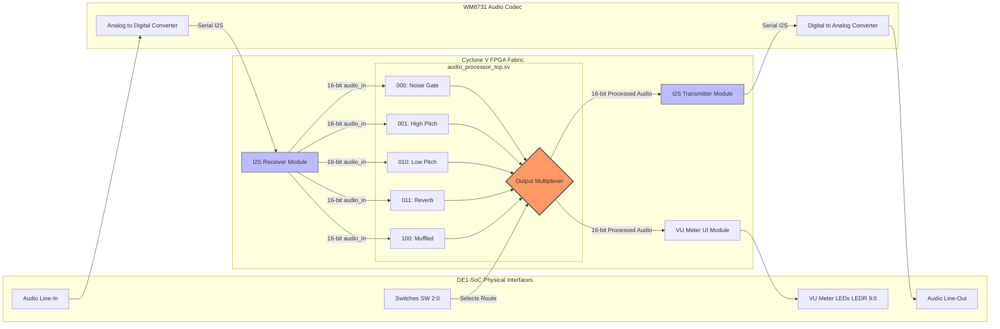

# FPGAudio Soundboard: Real-Time DE1-SoC DSP Engine

The FPGAudio Soundboard is a fully custom, hardware-accelerated digital signal processing (DSP) core written in SystemVerilog. Built for the Altera/Intel Cyclone V FPGA on the DE1-SoC development board, this project interfaces directly with the onboard WM8731 audio codec to perform zero-latency, real-time audio manipulation. 

Instead of relying on software or soft-core processors, all DSP math and memory management is implemented directly in the RTL fabric, demonstrating highly efficient, parallel hardware architecture.

---

## Hardware DSP Effects

Audio is streamed into the FPGA and fed into all DSP modules simultaneously. A hardware multiplexer routes the final processed signal to the DAC based on the physical switch positions.

* **`000` Noise Gate:** Professional dynamic range compression with adjustable threshold, attack, and release logic.
* **`001` High Pitch:** Real-time waveform holding using an internal 1042-cycle counter to shift frequencies.
* **`010` Low Pitch:** Audio period extension via a 2084-cycle delay buffer.
* **`011` Reverb:** Spatial depth created using a 512-sample Block RAM (BRAM) delay line and signal mixing.
* **`100` Muffled:** Hardware-implemented low-pass filter utilizing parallel sample summation.
* **`101` to `111` Clean Bypass:** Any other switch combination defaults to a direct pass-through of the raw microphone audio for A/B testing.

---

## Repository Architecture

| Directory / File | Description |
| :--- | :--- |
| `src/de1soc_top.sv` | Top-level physical pin mapping for the DE1-SoC board. |
| `src/audioprocessor_top.sv` | System integration and the parallel effect output multiplexer. |
| `src/effect_*.v` | The five isolated DSP mathematical cores. |
| `src/wm8731_*.v` | Low-level serial communication drivers (I2C, I2S) for the audio codec. |
| `src/util_*.v` | System utilities including the 12.5MHz master clock and VU meter. |
| `test/tb.sv` | SystemVerilog testbench for automated CI/CD verification. |
| `assets/` | Documentation and architecture images. |
| `demo/` | Python audio processing scripts that emulate the Verilog hardware logic for audible hackathon demonstration. |
| `.github/` | Hackathon CI/CD workflows and automated simulation output storage (do not modify). |

---

## Physical Board Setup

1. Connect the DE1-SoC audio line-in (microphone) and line-out (headphones) to the WM8731 codec jacks.
2. Use `KEY[0]` to issue a system-wide reset (active-low on the board, inverted internally).
3. Toggle `SW[2:0]` to switch between the live audio effects.
4. Observe `LEDR[9:0]`, which acts as a hardware VU meter visualizing the processed audio volume with smooth decay logic.

---

## Verification & CI/CD Simulation

This repository enforces strict ASIC-grade verification through automated GitHub Actions. On every push or pull request, Verilator compiles all files in `src/` and runs the comprehensive `test/tb.sv` testbench.

**The Testbench Verifies:**
* **Stimulus Generation:** Synthesizes 48kHz sine waves, impulse responses, and sawtooth waves to feed the DSP core.
* **Clock Synchronization:** Accurately models the 1042-cycle delay between the 50MHz system clock and the 48kHz audio ingestion.
* **Automated Checking:** Validates dynamic output and tests impulse decay across all parallel modules.
* **Artifact Generation:** Outputs `sim.log`, `wave.vcd`, `wave.svg`, `wave.json` files to `.github/outputs/` for headless waveform rendering.

**To run the simulation locally using Verilator:**
```bash
verilator -sv $(find src -name '*.v') $(find src -name '*.sv') test/tb.sv \
  --top-module tb \
  --binary \
  --trace \
  --timing \
  --assert \
  -Mdir sim_out
./sim_out/Vtb | tee sim.log
```

---

**DE1-SoC Data Flow Chart**

